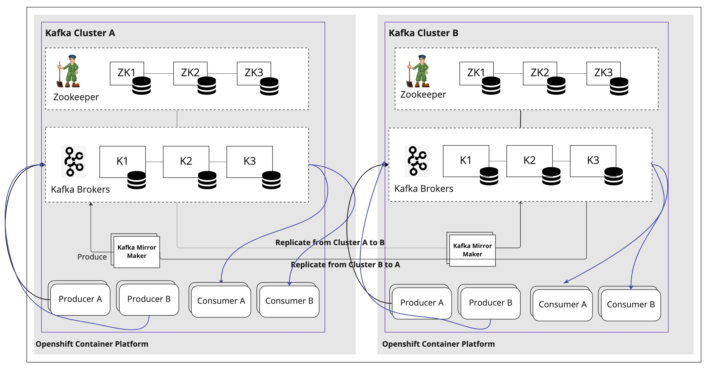
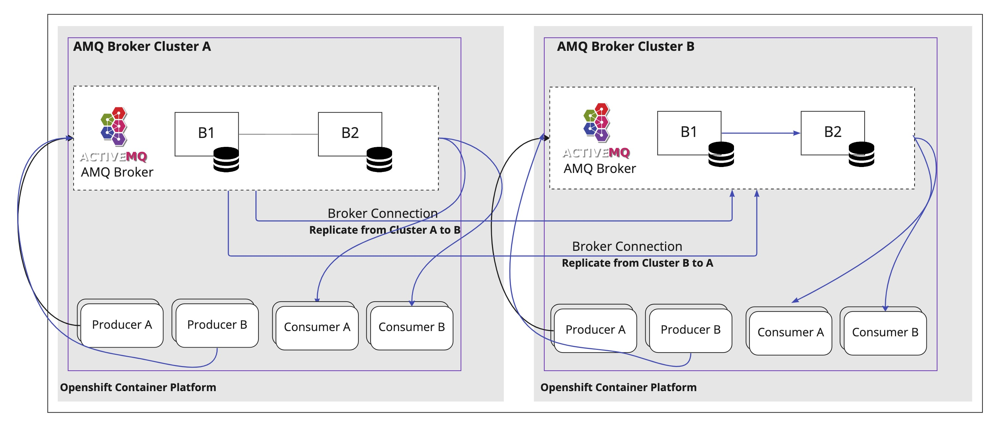

= Strimzi and ActiveMQ Artemis

Strimzi (AMQ Streams)

ActiveMQ Artemis (AMQ Broker)

== Operators installed 

* OpenShift User Workload Monitoring
* AMQ Streams Operator
* Grafana Operator
* Prometheus Operator
* AMQ Broker Operator

== Install The Demo Using Ansible

=== Parameters

[options="header"]
|=======================
| Parameter      | Example Value                                      | Definition
| dc_a_token     | sha256~vFanQbthlPKfsaldJT3bdLXIyEkd7ypO_XPygY1DNtQ | access token for DC A a user with cluster-admin privileges
| dc_b_token     | sha256~vFanQbthlPKfsaldJT3bdLXIyEkd7ypO_XPygY1DNtQ | access token for DC B a user with cluster-admin privileges
| dc_a_server    | https://api.mycluster.opentlc.com:6443             | OpenShift DC A Cluster API URL
| dc_b_server    | https://api.mycluster.opentlc.com:6443             | OpenShift DC B Cluster API URL
|=======================

=== Deploying the demo
----
export dc_a_token=sha256~dnMRt_XTTEdgDmO6fpi423A6as3X46_1XshCPI-zXW4
export dc_b_token=sha256~1XSWxLnqrOeqz8mmg6cPgNnk82SsC4kj6fwMV_Uqgwo
export dc_a_server=https://api.cluster-578cf.578cf.sandbox1078.opentlc.com:6443
export dc_b_server=https://api.cluster-h9xg5.h9xg5.sandbox72.opentlc.com:6443

ansible-playbook -e dc_a_token=${dc_a_token} -e dc_b_token=${dc_b_token} -e dc_a_server=${dc_a_server} -e dc_b_server=${dc_b_server} playbook.yml
----

oc process -f consumer-producer-template.yml \
  -p NAMESPACE=data-center-a \
  -p TOPIC=events \
  -p KAFKA_BROKER=my-source-cluster-kafka-bootstrap:9092 \
  | kubectl apply -f -

oc process -f consumer-producer-template.yml \
  -p NAMESPACE=data-center-a \
  -p TOPIC=events \
  -p KAFKA_BROKER=my-source-cluster-kafka-bootstrap:9092 \
  | kubectl apply -f -

oc process -f consumer-template.yml \
  -p NAMESPACE=data-center-b \
  -p TOPIC=my-source-cluster.events \
  -p KAFKA_BROKER=my-target-cluster-kafka-bootstrap:9092 \
  | kubectl apply -f -